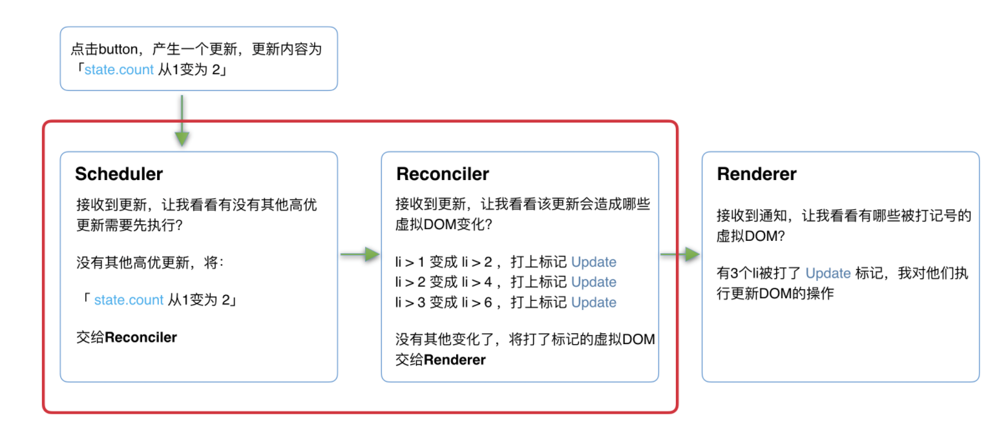

## 1、react 理念

### 1、react 的理念

react 是实现`快速响应`。

#### 1-1、制约快速响应的因素：

1、CPU 瓶颈：当遇到大计算量的操作或者设备性能不足使页面掉帧，导致卡顿。

主流浏览器刷新频率为 60Hz，即每（1000ms / 60Hz）16.6ms 浏览器刷新一次。

JS 可以操作 DOM，GUI 渲染线程与 JS 线程是互斥的。所以 JS 脚本执行和浏览器布局、绘制不能同时执行。

js 脚本执行--> 样式布局 ---> 样式绘制。当 js 执行时间过长，超过 16.6ms，这次刷新就没有时间执行样式布局和样式绘制。

解决方法：`时间切片` 在浏览器每一帧的时间中，预留一些时间「5ms」给 JS 线程，React 利用这部分时间更新组件，当预留时间不够用时，React 将线程控制权还给浏览器使其有时间去渲染 UI，React 等待下一帧时间来继续被中断的工作。

关键：将同步的更新变为可中断的异步更新。

2、IO 瓶颈：发送网络请求后，由于需要等待数据返回才能进一步操作导致不能快速响应。

网络延迟是无法解决的，但是可以减少用户对网络延迟的感知。

### 2、老的 react 架构

1、Reconciler: 协调器， 负责找出变化的组件，递归处理虚拟 DOM。

调用组件的 render 方法，将返回的 JSX 转为虚拟 DOM，将虚拟 DOM 和上次更新时的虚拟 DOM 对比，找出这次更新中变化的虚拟 DOM，通知 Renderer 将变化的虚拟 DOM 渲染到页面上。

2、Renderer: 渲染器， 负责将变化的组件渲染到页面上。

每次发生变化时，Renderer 接到 Reconciler 通知，将变化的组件渲染到当前宿主环境。

**缺点** ：更新是递归执行，一旦开始，中途就无法中断，当层级很深时，递归更新时间超过 16ms，用户交互就会卡顿。主要原因是因为协调器和渲染器交替进行，整个过程是同步的。

「 1 进入协调器，然后渲染器，2 进入协调器，然后渲染器...... 」

### 3、新的 react 架构

1、Scheduler(调度器): 调度任务的优先级，高优任务优先进入 Reconciler。

当浏览器有剩余时间时通知「react 实现了更完备的 requestIdleCallback」，在空闲时触发回调，提供了多种调度优先级。

2、Reconciler(协调器): 负责找出变化的组件。

将递归变为循环，每次循环都调用 shouldYield 先去判断当前是否有剩余时间。

将老的同步更新的架构改为异步中断更新，曾经递归的虚拟 DOM 数据结构已经无法满足需要。

**解决 react 15 缺点的办法**：协调器和渲染器不再是交替工作，当 scheduler 将任务交给 Reconciler 后，Reconciler 会为变化的虚拟 DOM 打上代表增删改查的标记，整个 scheduler 和 Reconciler 的工作都是在内存中进行，只有当所有组件都完成 Reconciler 的工作，才会统一交给 Renderer。

3、Renderer(渲染器): 负责将变化的组件渲染到页面上。

根据 Reconciler 为虚拟 DOM 打的标记，同步执行对应的 DOM 操作

当有其他更高优任务需要先更新，或者当前帧没有剩余时间时，会被中断，但是因为红框中的工作都是在内存中进行的，所以不会更新页面上的 DOM，即使反复中断，用户也不会看到更新不完全的 DOM。

### 4、Fiber 架构

#### 1、Reconciler 内部采用了`Fiber`架构。

`异步可中断更新`：更新在执行过程中可能会因为浏览器时间分片用尽或有更高优的任务插入被打断，当可以继续执行时恢复之前执行的中间状态。

- 代数效应：将副作用从函数逻辑中分离，使函数关注点保持纯粹。
- 代数效应在 react 中的应用：Hooks。
- Generator：和 async. await 一样，具有传染性，执行的中间状态是上下文关联的，单一的可以，但是高优先级任务插入时，不能满足条件，当有上下文关联时，需要重新计算。

**React Filber**：react 内部实现的一个状态更新机制，支持不同优先级，可中断或者恢复，恢复后可复用之前的中间状态。

Filber 节点：每个任务更新单元。

