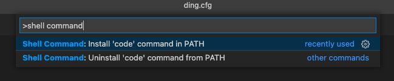

### mac 的安装工具。

1、安装微信、谷歌、腾讯会议、搜狗输入法等用到的软件。

2、需要安装 brew,作为 macOS 必备的包管理工具.

```shell
/bin/zsh -c "$(curl -fsSL https://gitee.com/cunkai/HomebrewCN/raw/master/Homebrew.sh)"
```

在这个过程中 mac 中会提示需要安装 git，点击安装即可。

3、需要安装 node.

可以从 `https://nodejs.org/dist/` 下载 node 的安装包，mac 为 pkg 格式，windows 为 msi 格式.
或

```shell
brew link node
brew uninstall node
brew install node
```

3-1、安装指定版本 node -- nvm

```shell
brew install nvm
------------------------------
cd ~
vim .bash_profile
> 需要在shell的配置文件(~/.bash_profile，没有的话自行touch .bash_profile)中添加：
> # For NVM
> export NVM_DIR=~/.nvm
> source $(brew --prefix nvm)/nvm.sh
按shift i键进入insert转态 添加上述内容；
写完后按esc键退出insert转态,再输入:wq(保存退出)；
接着重新source
source .bash_profile
------------------------------
nvm ls-remote //查看 所有的node可用版本
nvm install xxx //下载你想要的版本
nvm use xxx //使用指定版本的node
nvm alias default xxx //每次启动终端都使用该版本的node
```

可以通过`node --version` 和 `npm --version` 来查看版本，如果正常展示版本，代表安装成功。

4、需要换一下源。

```shell
npm config set registry https://registry.npm.taobao.org
npm config get registry  # 验证
```

5、更新 zsh

```shell
brew install zsh
```

查看当前使用的 shell, `echo $SHELL`

查看安装的 shell, `cat /etc/shells`,

切换到 zsh, `chsh -s /bin/zsh `.

重启终端。

6、macOS 自带的终端，使用起来不是特别方便，所以可以换成 iTerms 终端尝试一下。

可以查看：https://www.cnblogs.com/xishuai/p/mac-iterm2.html

7、配置 oh-my-zsh 「也是看上面这个地址」

```shell
sh -c "$(curl -fsSL https://raw.github.com/robbyrussell/oh-my-zsh/master/tools/install.sh)" #如果很慢，记得换源
```

8、自动填充

```shell
git clone https://github.com/zsh-users/zsh-autosuggestions ~/.oh-my-zsh/custom/plugins/zsh-autosuggestions
```

9、关联公司和 github 与本地

查看地址：https://zhuanlan.zhihu.com/p/37958487

- 先检查 mac 上是否存在 ssh key， `ls -al ~/.ssh`
- 不存在生成 ssh key; `ssh-keygen -t rsa -C 邮箱账号`
- 复制 `pbcopy < ~/.ssh/id_rsa.pub`

需要修改 config 文件

```shell
code ~/.ssh/config

# github
Host github.com
HostName github.com
PreferredAuthentications publickey
IdentityFile ~/.ssh/id_rsa_github
```

10、因为有 github 和 gitlab 两个，所以名称需要换一下。

```shell
git remote rm github_origin
git remote add github_origin git@github.com:McDullPig/blog.git
```

11、macOS 中 vscode 终端快速打开 command not found: code



解决方案：打开 Visual Studio 代码，通过（⇧⌘P）打开命令面板，然后键入以找到 Shell 命令：shell command

执行命令后，重新启动终端以使新的$ PATH 值生效。
